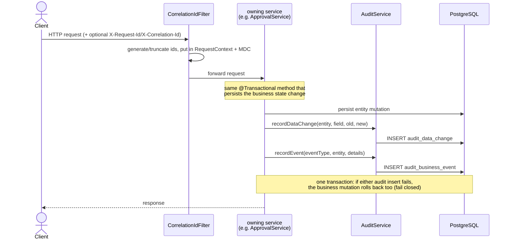

# Audit Flow

`my_docs/plan.md` §5 names this `audit-flow.png`. See
[ADR-005](../adr/ADR-005-audit-strategy.md) for the design rationale (explicit call, not a listener
or AOP) and `my_plan/week10-audit-security-observability-plan.md` for the full scoping decisions.

Both audit tables are append-only by construction (`AuditController` exposes only `@GetMapping`s);
`actor`/`requestId`/`correlationId` are sourced from `SecurityContextHolder`/`RequestContext`, never
passed by the caller.
