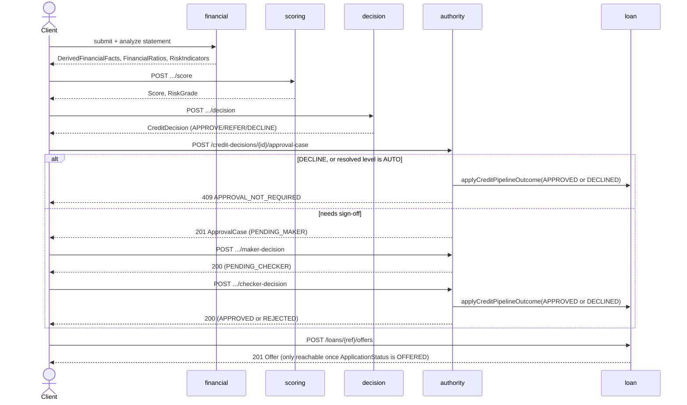

# Credit Decision Flow (Track B)

`my_docs/plan.md` §5 names this `credit-decision.png`. See
[domain/decisioning.md](../domain/decisioning.md) for the endpoint reference and
[ADR-004](../adr/ADR-004-credit-decision-engine.md)/[ADR-006](../adr/ADR-006-maker-checker.md) for
the design rationale.

The `Authority -> Loan` call is Week 12's addition (`ApprovalService.applyCreditPipelineOutcome` via
`LoanApplicationService`) — before it existed, the flow ended at the `ApprovalCase`/`CreditDecision`
response and the final `POST /offers` step was unreachable from this track.
