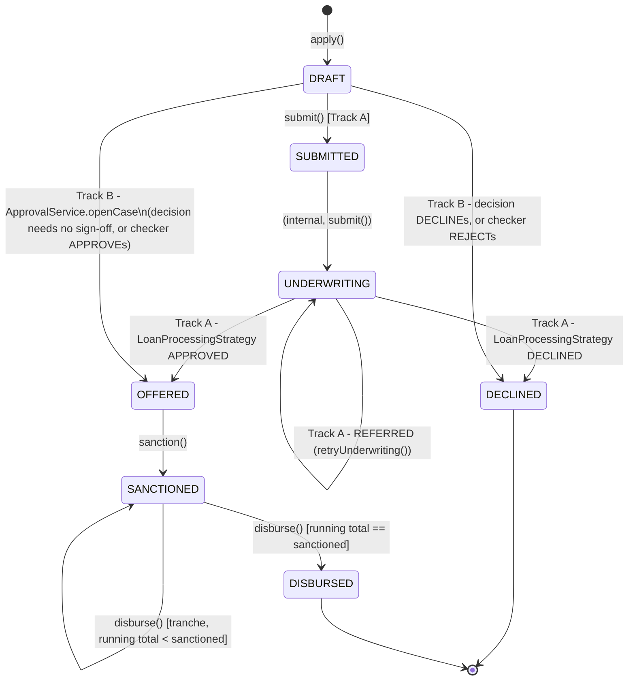

# Loan Lifecycle

`my_docs/plan.md` §5 names this `loan-lifecycle.png`. State machine enforced by
`loan/support/ApplicationLifecycle`; see [domain/loan-lifecycle.md](../domain/loan-lifecycle.md) for
the operational detail and [architecture/overview.md](../architecture/overview.md) for why there are
two triggers into `OFFERED`/`DECLINED`.

Track B's edges from `DRAFT` are drawn directly (not through `SUBMITTED`/`UNDERWRITING`) because
`applyCreditPipelineOutcome` advances through those two states internally, without running Track
A's `LoanProcessingStrategy`, when it finds the application still at `DRAFT`. The two tracks don't
compose: whichever reaches `OFFERED`/`DECLINED` first wins, and the loser's finalize call becomes a
no-op (see [ADR-004](../adr/ADR-004-credit-decision-engine.md)'s "Negative" consequence).
