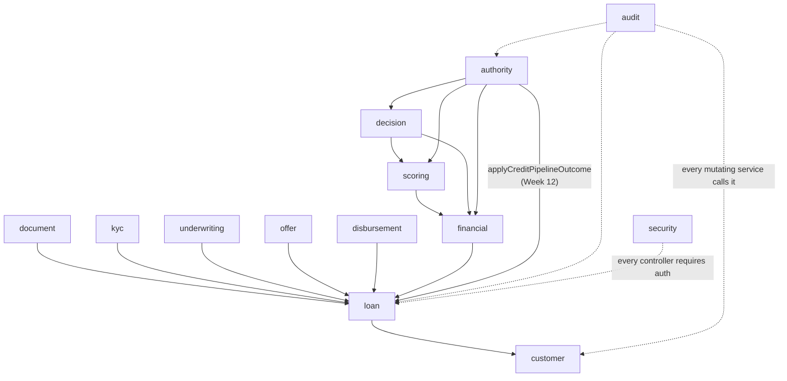

# Module Boundaries

`my_docs/plan.md` §5 names this `module-boundaries.png`; see
[domain-boundaries.md](../architecture/domain-boundaries.md) for the full table this diagrams (one
row per module: aggregate root, DB invariant, cross-module dependency).

Solid arrows are direct repository/service calls (no event bus — see the architecture overview's
"Cross-module calls" section); dotted arrows are the two cross-cutting modules every mutating
service calls into. `loan <- authority` is the one arrow Week 12 added — before that, `authority`
computed a `CreditDecision`/`ApprovalCase` outcome that never reached `loan` at all.
