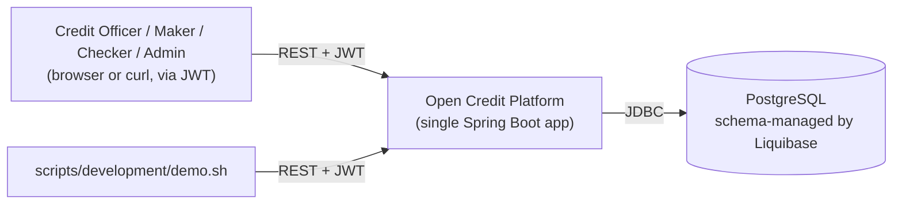

# System Context

`my_docs/plan.md` §5 names this `system-context.png`; it's Mermaid here instead — GitHub renders
the fenced block below natively, and a portfolio repo doesn't need a separate image-generation step
for something this simple.

One deployable, one database, no external services (no IdP, no message broker, no third-party credit
bureau integration) — see [ADR-001](../adr/ADR-001-modular-monolith.md) for why.
